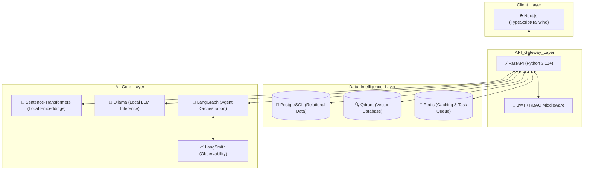

# AI Job Board | Intelligence-Driven Recruitment Ecosystem

## 🚀 Business Overview

The AI Job Board is a production-ready, high-performance recruitment platform designed to bridge the gap between top-tier talent and innovative companies. By leveraging state-of-the-art Large Language Models (LLMs) and vector search technology, it transforms the traditional job search into a precise, automated, and insights-driven experience.

### Key Value Propositions:

- **Advanced Structured Matching**: Beyond simple keyword search, our system uses LLMs to parse CVs and Jobs into structured JSON data, allowing for multi-dimensional matching (Skills vs. Requirements, Tools, Experience).
- **Automated Talent Operations**: Integrated LangGraph agents generate optimized job descriptions and parse complex CVs into structured profiles instantly.
- **Privacy-First Intelligence**: 100% local embedding and inference pipeline (Ollama + Sentence-Transformers) ensuring zero data leakage and zero API costs.
- **Enterprise-Grade RBAC**: Fine-grained access control for Candidates, Employers, and Administrators.

---

## 🏗️ System Architecture & Workflow

The platform utilizes a modern, distributed monorepo architecture designed for maximum modularity and AI-agent compatibility.

### High-Level Technical Architecture

### 🧠 Core AI Workflows

1. **Structured CV Parsing**: When a PDF CV is uploaded, the system extracts text using `PyPDF2`. A local LLM (Ollama) then structures this raw text into a JSON schema containing `personal_info`, `grouped_skills`, `experience_summary`, and `education`.
2. **Semantic Match Pipeline**: Text vectors are generated using `all-MiniLM-L6-v2` (384-dim) and stored in **Qdrant**, enabling sub-100ms similarity searches.
3. **Multi-Agent Matching & Reasoning**: For every application, an AI Agent compares the structured candidate JSON with the structured job JSON to generate a "Rationale" – a human-like explanation of why the candidate is a fit, highlighting overlaps and missing must-haves.

---

## 🏗️ Engineering Challenges & Logical Solutions

### 1. High-Performance, Zero-Cost AI Inference
**Challenge**: Providing semantic search and text generation without incurring high API costs or introducing network latency.
**Solution**: Implemented a fully local AI stack. We use `sentence-transformers` for embeddings and **Ollama (Llama 3)** for structured parsing and reasoning. This creates a production-grade environment with zero inference costs and 100% data privacy.

### 2. Intelligent Data Structuring from Unstructured PDFs
**Challenge**: CVs are famously diverse in format, making regex-based parsing unreliable for deep intelligence.
**Solution**: Developed an LLM-based parser that treats CV text as unstructured input and converts it into a validated Pydantic-style JSON structure. This allows the matching engine to compare "Python" in the Skills section with "Python" in the Job Requirements with 10x higher precision than simple text search.

### 3. Observability in Agentic Workflows
**Challenge**: Debugging AI agent decisions and performance in a production environment.
**Solution**: Integrated **LangSmith** deep-tracing into every AI endpoint. Every LLM call and agent step is logged, allowing us to monitor latency, token usage, and accuracy while iterating on prompts in a "10x Developer" workflow.

---

## 🛠️ Technology Stack

- **Frontend**: Next.js (App Router), TypeScript, TailwindCSS, Framer Motion.
- **Backend**: FastAPI, SQLAlchemy ORM, Pydantic, PyPDF2.
- **Database**: PostgreSQL (Relational), Qdrant (Vector Store), Redis (Cache).
- **AI/ML Core**: Ollama (Local LLM), LangGraph (Agents), Sentence-Transformers.
- **DevOps/Monitoring**: Docker Compose, LangSmith, n8n (Automations).

---

## 🚧 Status: Active Development

The project is currently in a phase of rapid expansion. 

---

> [!NOTE]  
> This repository is a **Public Showcase** project. It demonstrates high-level engineering patterns, AI integration strategies (RAG, Structured Output), and full-stack architecture.
