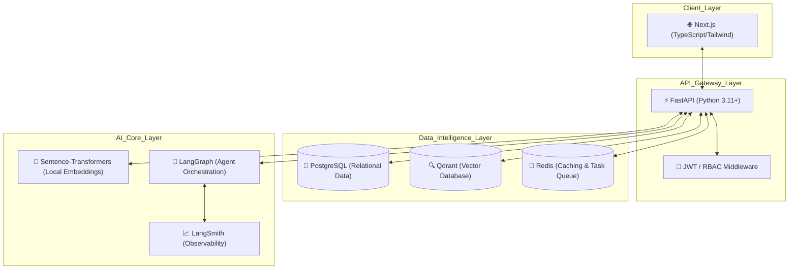

# AI Job Board | Intelligence-Driven Recruitment Ecosystem

## 🚀 Business Overview

The AI Job Board is a MVP high-performance recruitment platform designed to bridge the gap between top-tier talent and innovative companies. By leveraging state-of-the-art Large Language Models (LLMs) and vector search technology, it transforms the traditional job search into a precise, automated, and insights-driven experience.

### Key Value Propositions:

- **Precision Matching**: Uses semantic embeddings to match candidates with jobs based on deep context, not just keywords.
- **Automated Talent Operations**: Integrated LangGraph agents generate optimized job descriptions and parse complex CVs instantly.
- **Privacy-First Intelligence**: 100% local embedding and inference pipeline ensuring zero data leakage and zero API recurring costs.
- **Enterprise-Grade RBAC**: Fine-grained access control for Candidates, Employers, and Administrators.

---

## 🏗️ System Architecture & Workflow

The platform utilizes a modern, distributed monorepo architecture designed for maximum modularity and AI-agent compatibility.

### High-Level Technical Architecture

### 🧠 Core AI Workflows

1. **Semantic Match Pipeline**: When a CV is uploaded, the system extracts text and generates a 384-dimensional vector using `all-MiniLM-L6-v2`. This vector is stored in **Qdrant**, allowing for sub-100ms similarity searches against job postings.
2. **Generative Job Engineering**: Employers can trigger a **LangGraph** agent that researches the role requirements and drafts a professional, SEO-optimized job description tailored to the company's voice.
3. **Automated ATS Import**: The system can ingest external job URLs, using AI to structure raw HTML into validated database records.

---

## 🏗️ Engineering Challenges & Logical Solutions

### 1. High-Performance, Zero-Cost AI Inference
**Challenge**: Providing semantic search and text generation without incurring high OpenAI/Anthropic API costs or introducing network latency.
**Solution**: Implemented a fully local AI stack. We use `sentence-transformers` running natively in the FastAPI worker for embeddings and a local Dockerized Qdrant instance. This results in a "Free-Tier" production environment that is 100% private and extremely fast.

### 2. Multi-Role UI Synchronization
**Challenge**: Managing complex state and permissions across Candidate and Employer dashboards while maintaining a seamless user experience.
**Solution**: Utilized Next.js Server Components and advanced middleware for Auth/RBAC. The frontend dynamically adapts its layout and data fetching strategy based on the JWT payload, ensuring data isolation and security at the edge.

### 3. Observability in Non-Deterministic AI Flows
**Challenge**: Debugging AI agent decisions and performance in a production environment.
**Solution**: Integrated **LangSmith** deep-tracing into every AI-related endpoint. Every embedding call and agent step is logged, allowing for real-time performance monitoring and iterative prompt refinement.

---

## 🛠️ Technology Stack

- **Frontend**: Next.js, TypeScript, TailwindCSS, Framer Motion.
- **Backend**: FastAPI, SQLAlchemy ORM, Pydantic.
- **Database**: PostgreSQL (Structured), Qdrant (Vector), Redis (Cache).
- **AI/ML**: LangGraph, LangFlow (Prototyping), Sentence-Transformers, HuggingFace.
- **DevOps**: Docker & Docker Compose, n8n (Automations), LangSmith.

---

## 🚧 Status: Active Development

The project is currently in a phase of rapid expansion. Upcoming features include:
- **Phase 6**: Programmatic SEO system for Google Jobs integration.
- **Phase 7**: Playwright-based E2E visual regression testing.
- **Phase 9**: n8n-powered job scraping and automated Slack notifications for matches.

---

> [!NOTE]  
> This repository is a **Public Showcase** project. It is designed to demonstrate high-level engineering patterns, AI integration strategies, and full-stack architecture. For security reasons, environment variables and proprietary API keys are managed via `.env.template`.
