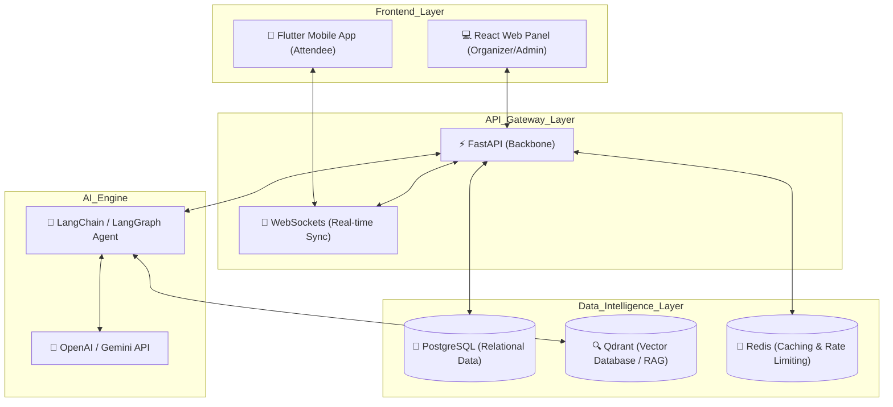

# EventCore AI | Next-Gen Event Management SaaS with AI-Powered Intelligence

## 🚀 Business Overview

EventCore AI is a comprehensive SaaS platform designed to revolutionize event management and coordination. Built for scalability and real-time interaction, it bridges the gap between organizers and attendees through an intuitive interface and advanced AI capabilities. EventCore transforms static event data into dynamic, searchable knowledge bases, enabling automated attendee support and seamless incident management.

### Key Value Propositions:

- **Scalable Infrastructure**: Designed to handle high-concurrency events with real-time updates.
- **AI-Driven Support**: Built-in RAG (Retrieval-Augmented Generation) system to handle complex attendee queries automatically.
- **Secure by Design**: Role-based access control (RBAC) and data anonymization protocols ensure enterprise-grade security.

---

## 🛠️ System Architecture & Workflow

EventCore AI utilizes a modern, distributed architecture to ensure low latency and high availability.

### High-Level Architecture (Mermaid)

### 📱 Applications & Interfaces

- **Organizer Dashboard (React)**: A powerful command center for creating events, managing attendee lists, and monitoring RAG performance.
- **Attendee Mobile Experience (Flutter)**: Real-time event navigation, interactive chat with the AI assistant, and SOS/Emergency features.
- **AI Agent (RAG Implementation)**: The system indexes event documentation into **Qdrant**. When a user asks a question, the **LangChain** agent retrieves relevant context and generates precise, halluncination-free responses using State-of-the-Art LLMs.

---

## 🏗️ Engineering Challenges & Logical Solutions

### 1. Robust Real-time State Synchronization

**Challenge**: Ensuring that hundreds of mobile clients receive instant updates (e.g., event status changes) without overwhelming the database.
**Solution**: Implemented a **WebSocket** mesh with **Redis** as a pub/sub broker. This decoupled the API from the live connections, allowing the system to broadcast updates efficiently using the "Room" pattern.

### 2. Securing WebSockets with JWT

**Challenge**: WebSockets don't natively support standard HTTP headers for authentication in all environments.
**Solution**: Developed a custom middleware that validates JWT tokens during the initial handshake and maintains session integrity through heartbeats. Tokens are refreshed periodically without interrupting the socket connection.

### 3. Mitigating LLM Hallucinations in RAG

**Challenge**: AI assistants might provide incorrect data about event schedules or safety protocols.
**Solution**: Implemented a strict **self-correction loop using LangGraph**. The agent verifies retrieved context against the query before generating a response. If no relevant info is found, the agent politely redirects the user to a human organizer rather than guessing.

### 4. High-Performance Vector Search

**Challenge**: Scaling semantic search across thousands of event segments.
**Solution**: optimized Qdrant indexing with custom payload filtering to ensure that search queries are isolated per event ID, resulting in sub-100ms response times even under load.

---

> [!NOTE]  
> This repository is a **Public Showcase** intended for recruitment purposes. The core proprietary logic, financial models, and private keys have been intentionally omitted. For a deep dive into my coding style, please refer to the [Snippets](#) section below.
